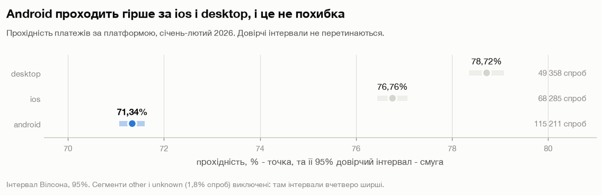
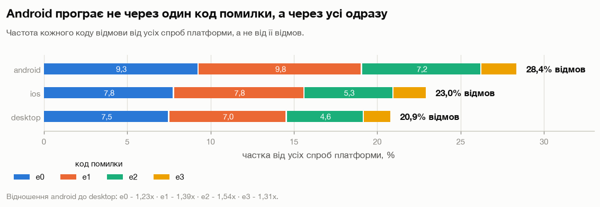
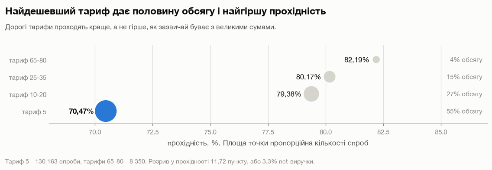
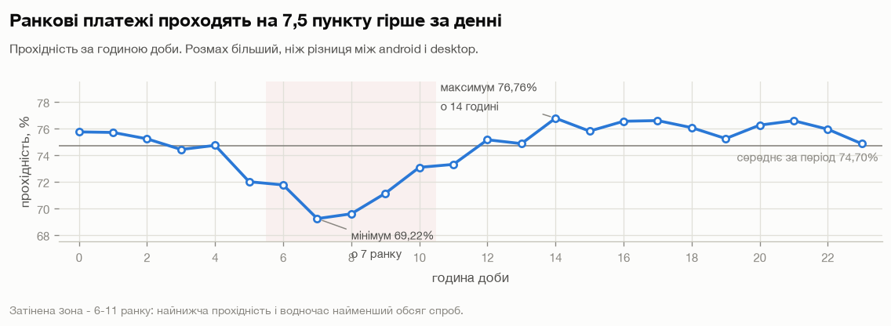
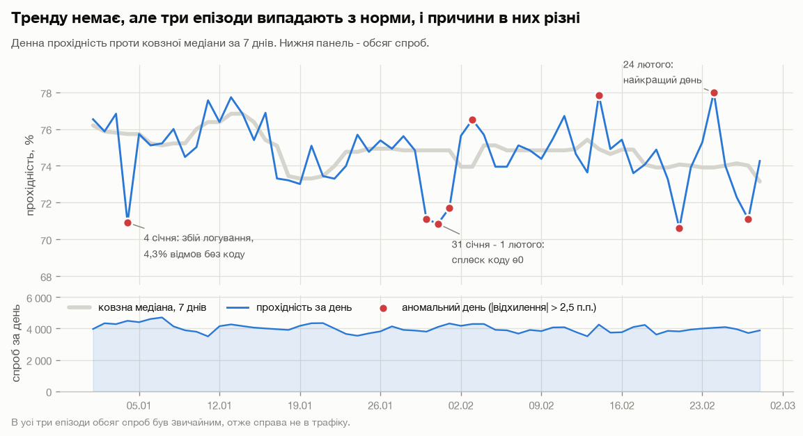
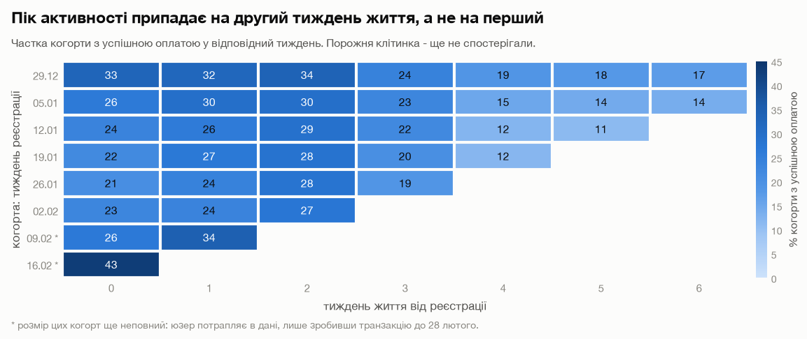
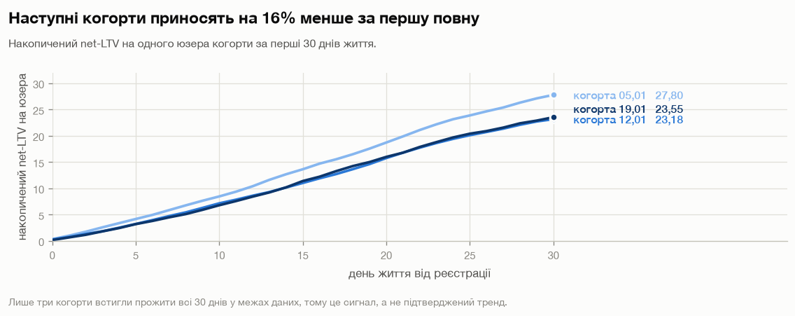
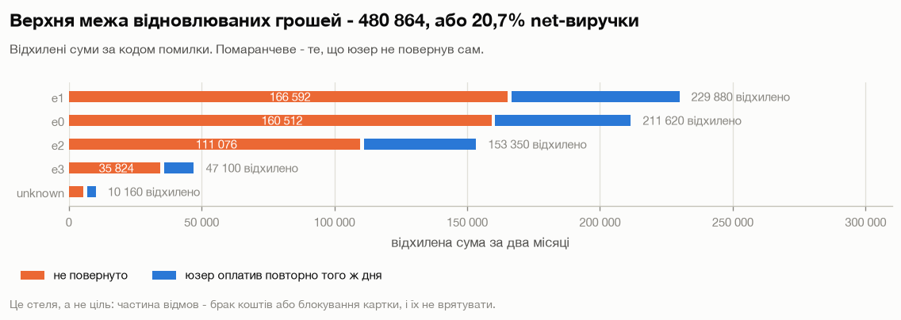

# Аналіз платіжних транзакцій

[English](README.md) | **Українська**

Повний аналіз даних про карткові платежі: 236 918 спроб оплати від 40 210 юзерів за два місяці (січень–лютий 2026). У проєкті є аудит якості даних, прохідність, chargeback-rate, виручка, LTV, календарний і когортний аналіз. Кожна знайдена різниця перевірена на статистичну значущість і оцінена в грошах, а з висновків складено список рекомендацій за пріоритетом.

**Стек:** Python 3.13 · DuckDB (SQL) · pandas · SciPy · Matplotlib · Jupyter

---

## Зміст

- [Про проєкт](#про-проєкт)
- [Ключові метрики](#ключові-метрики)
- [Висновки](#висновки)
- [Рекомендації](#рекомендації)
- [Методологія](#методологія)
- [Обмеження](#обмеження)
- [Структура репозиторію](#структура-репозиторію)
- [Дані](#дані)
- [Як запустити](#як-запустити)

---

## Про проєкт

Аналіз відповідає на три групи питань:

1. **SQL-метрики на рівні юзера.** Для кожного юзера рахується загальний спенд, статус останньої транзакції і те, чи була в нього хоч одна успішна оплата. Кожну метрику порахував щонайменше двома способами і звірив результати між собою. Окремо показано, як відповісти на всі три питання одним запитом без підзапитів і без WITH.
2. **Ефективність платежів.** Прохідність, chargeback-rate, виручка і LTV у розрізах за брендом картки, країною, платформою, сумою платежу, віком і активністю юзера.
3. **Що саме призводить до втрат і що можна повернути.** Структура кодів відмов, календарні аномалії, поведінка когорт і верхня межа виручки, яку можна відіграти.

Уся агрегація зроблена в SQL поверх одного очищеного шару. pandas і SciPy використовуються тільки для статистичних тестів і графіків.

## Ключові метрики

| Метрика | Значення |
|---|---|
| Спроб оплати | 236 918 |
| Юзерів | 40 210 |
| Прохідність на рівні спроб | 74,70% |
| Прохідність на рівні юзер-день | 83,96% |
| Chargeback-rate (від успішних транзакцій) | 0,544% |
| Net-виручка | 2 325 365 |
| Net-виручка на активного юзера | 57,83 |
| LTV(30), середнє / медіана | 26,62 / 5,0 |

Розрив між прохідністю на рівні спроб і на рівні юзер-день (9,3 пункту) показує, скільки повертають повторні спроби того ж дня: приблизно кожна четверта відмова закінчується успішною оплатою того ж дня.

## Висновки

### 1. Головний фактор прохідності це платформа

Android проходить на 7,4 пункту гірше за desktop (71,34% проти 78,72%). При цьому android є найбільшим каналом, на нього припадає майже половина всіх спроб. Якщо підтягнути його до рівня desktop, net-виручка виросте приблизно на 4,2%. 95% довірчі інтервали трьох платформ не перетинаються.



Розрив не пояснюється одним кодом помилки. На android одночасно підвищені всі чотири коди відмов (у 1,23–1,54 раза відносно desktop), а це вказує на аудиторію або наскрізний сценарій оплати, а не на баг в одному кроці інтеграції.



### 2. Найдешевший тариф проходить найгірше

Зазвичай великі суми відхиляються частіше. Тут навпаки: найдешевший тариф дає 55% обсягу і проходить у 70,47% випадків, а найдорожчі тарифи у 82,19%. До того ж 3,5% спроб у дорогих тарифах приносять майже стільки ж виручки, скільки 55% у найдешевшому.



### 3. Сильний ефект години доби, тренду в часі немає

Прохідність падає до 69,22% о сьомій ранку і досягає піку 76,76% удень. Розмах 7,5 пункту, це більше за розрив між платформами. Провал припадає на години з найменшою кількістю спроб, що схоже на ранкові автосписання, які впираються в брак коштів.



Денна прохідність за два місяці не має тренду. З норми випадають три епізоди з різними причинами: збій логування 4 січня (сплеск відмов без коду), сплеск одного коду відмови 30 січня – 1 лютого і найкращий день періоду 24 лютого.



### 4. Когорти вказують на пробний період приблизно на два тижні

Пік активності когорти припадає не на перший тиждень після реєстрації, а на другий, і перша оплата в середньому настає на 11 день. Клітинки, які ще не можна спостерігати, лишаються порожніми, а не нульовими, щоб цензурування не читалося як відтік.



Накопичений LTV росте майже лінійно. Перша повна когорта за 30 днів приносить приблизно на 16% більше за дві наступні, але повне 30-денне вікно мають лише три когорти, тому це сигнал для моніторингу, а не підтверджений тренд.



### 5. Бренд картки ні на що не впливає

Visa і Mastercard мають однакову прохідність (74,76% проти 74,64%, p-value 0,51), однаковий chargeback-rate (p-value 0,81) і однаковий LTV за 30 днів (тест Манна-Вітні, p-value 0,75). Різниця не з'являється й усередині окремих країн чи платформ.

### 6. Скільки виручки можна повернути

Приблизно чверть відхилених сум юзери повертають самі, повторюючи спробу того ж дня. Решта задає верхню межу того, що можна відіграти кращою ретрай-логікою: 480 864, або 20,7% net-виручки. Це стеля, а не ціль, бо частина відмов пов'язана з браком коштів або заблокованими картками.



## Рекомендації

За очікуваним ефектом:

1. **Розібратись, чому android програє.** Ефект до 4,2% net-виручки. Починати варто з різниці в платіжних методах, сценарії 3DS і джерелах трафіку, а не з пошуку одного бага.
2. **Перенести автосписання з ранку на вечір.** Ефект помірний, але для перевірки достатньо змінити розклад, продукт чіпати не треба.
3. **Розібратись із найдешевшим тарифом.** Ефект до 3,3% net-виручки. Найімовірніше, за ним стоїть окремий сценарій, наприклад пробне або мінімальне списання, куди потрапляють картки гіршої якості.
4. **Побудувати ретрай-логіку навколо коду e0.** На нього припадає 33,3% відмов, він відновлюється лише у 24,2% випадків і є останньою транзакцією для 37,2% юзерів, які пішли після відмови.
5. **Залишити обидва карткові бренди.** Вимірюваної різниці між ними немає.
6. **Полагодити логування кодів відмов.** 659 відмов не мають коду, і третина з них припадає на один день.
7. **З'ясувати, що за канал без визначеної платформи.** Його 413 юзерів показують найкращі цифри в базі: прохідність 87,39%, LTV(30) 51,42 і 93,4% платників.

## Методологія

- **Аудит даних до будь-яких розрахунків.** Аудит перевіряє NULL, повтори id_order, хронологію, те, що chargeback стоять тільки на успішних транзакціях, і два різні значення відсутнього коду помилки.
- **Один очищений SQL-шар.** `transactions_clean` змінює тільки типи і додає похідні колонки. Жоден рядок не видаляється, а кожен виняток прямо описаний у розрахунку, де він застосовується.
- **Метрики визначені заздалегідь.** Chargeback-rate рахується від успішних транзакцій, як у карткових схемах. Виручка показана gross і net, за вирахуванням chargeback. LTV усічений до 7, 14 і 30 днів і рахується на всіх юзерів когорти, разом з тими, хто не платив.
- **Селекція в LTV.** Юзер потрапляє в дані лише після першої спроби оплати, тому пізні когорти складаються переважно зі швидких платників. LTV рахується на узгодженій базі, а наївна база показана поруч.
- **Розрізи.** Усі розрізи будуються однією параметризованою SQL-функцією, і кожен звіряється з базовими підсумками.
- **Перевірка значущості.** Z-тест для двох часток з інтервалами Вілсона перевірено хі-квадратом. Скошений LTV порівнюється тестом Манна-Вітні. Поправка Бонферроні враховує множинні порівняння. Розмір ефекту показаний як частка net-виручки.
- **Структура відмов.** Для кожного коду рахується, як часто відмову відновлюють того ж дня і як часто вона стає останньою транзакцією юзера.
- **Календарні аномалії.** День вважається аномальним, якщо відхиляється від ковзної медіани за 7 днів більше ніж на 2,5 пункту.

## Обмеження

- Дані покривають лише два місяці, тому повний LTV порахувати неможливо. Усі когортні висновки спираються на усічені горизонти.
- Юзерів, які зареєструвались і жодного разу не пробували заплатити, у даних немає, тому виручка на юзера рахується на активного юзера.
- Немає банку-емітента, еквайра, типу продукту і розшифровки кодів відмов. Причини відмов відновлені з поведінки, і такі висновки позначені як гіпотези.
- Валюта не вказана, тому грошові ефекти читаються як частки виручки, а не як абсолютні суми.

## Структура репозиторію

```
.
├── payments_analysis.ipynb        # повний аналіз зі збереженими виводами
├── sql/
│   └── user_metrics_bigquery.md   # запити на рівні юзера в синтаксисі BigQuery і відмінності діалектів
├── data/
│   └── transactions.parquet       # датасет
├── images/                        # графіки
├── requirements.txt
└── LICENSE
```

## Дані

Знеособлений датасет спроб карткових платежів, один рядок на одну спробу. Ідентифікатори сурогатні, а суми подані в умовних одиницях без валюти.

| Колонка | Опис |
|---|---|
| `id_order` | Ідентифікатор замовлення |
| `id_user` | Ідентифікатор юзера |
| `status` | `success` або `fail` |
| `date_created` | Час спроби оплати |
| `amount` | Сума платежу |
| `card_brand` | `VISA` або `MC` |
| `error` | Код відмови (0–3), порожній для успішних спроб |
| `country` | Країна юзера |
| `platform` | `android`, `ios`, `desktop`, `other` |
| `date_reg` | Час реєстрації юзера |
| `is_chargeback` | Чи був по платежу chargeback |

## Як запустити

```bash
python -m venv .venv
.venv/bin/pip install -r requirements.txt
```

Відкрий `payments_analysis.ipynb` у JupyterLab, VS Code або PyCharm і запусти всі клітинки. Перша клітинка сама збере локальний `payments.duckdb` з parquet-файлу. Повний прогін займає близько хвилини.
